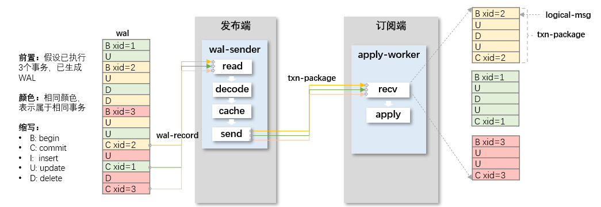

+++
date = '2026-02-10T16:15:52+08:00'
draft = false
title = '逻辑复制'
categories = ["Database"]

tags = ["MVCC", "PostgreSQL", "Transaction", "Logical Replication"]
ShowToc = true
TocOpen = true
+++

## 基本概念

逻辑复制是数据同步的一种方式，逻辑二字主要指的是传输数据的格式，与之相对的是物理复制。

### 1. 逻辑数据格式

逻辑数据格式是指，能够由一定规则描述的，符合SQL直觉的一种数据格式，例如：

```bash
[MsgType：Insert，Relation：test，New Tuple：[a, int, 100]]
```
从这种数据格式上，能够通过解析等方式，将数据还原为SQL语句，这也同时表现了逻辑复制的第一个特点：**无视物理结构上的差异，可以在异构、跨版本的数据库之间进行数据同步**。

接上例，通过一定的解析步骤，我们总能够得到：

```sql
Insert into test(a) values 100::int;
```

对于不同内核来说，可能在语法上稍有差异，但只需要修改一些解析方式，也能够得到自身看的懂、可以运行的命令。

### 2. 与物理复制的区别

逻辑复制的另外一个特点，是相对于另一种主流的数据同步方式：物理复制，来作为比较的。

几乎所有的数据库内核，在进行数据存储的时候，都是采用随机写的方式，最大化利用性能优势，将数据存储在磁盘上。那么从物理上看，一个relation的所有数据，可能并不是连续的：他们可能分布在不同的page上，由指针进行连接。那么从磁盘角度看，一个page的分布，可能是这样的：

```bash
--------------
Page Header
--------------
Tuple 1 for r1
--------------
Tuple 2 for r1
--------------
Tuple 1 for r2
--------------
Tuple 1 for r3
--------------
Tuple 2 for r2
--------------
```

如此一来，想要在物理层面进行数据传输时，以page为单位，是无法将不同relation的tuple分开的，也就是细粒度不够。

逻辑复制的另一个特点，是可以以表为单位，进行数据同步，由一个Reader完成。

Reader逐行的去读取物理中的tuple，筛选那些符合要求的tuple，进行下一步工作。

逻辑复制提高的数据同步的细粒度，可以在库、表、甚至行上进行数据过滤，显然是一种更灵活的同步方式，在某些场景下，其效果更好，常见的有：

> **应用场景**
>
>1. 某数据库使用厂商需要进行版本升级，但升级前后版本由于迭代问题，在物理存储上存在差异，导致无法进行直接替换；
>2. 某数据库使用厂商需要将原有的数据库数据迁移到一款新的数据库产品上，而这两个数据库的内核架构完全不同，物理存储存在本质差异；
>3. 某厂商部门之间使用的数据库产品不同，但部门之间存在协作，需要进行数据传递；
> ...

## 架构



如图所示，


